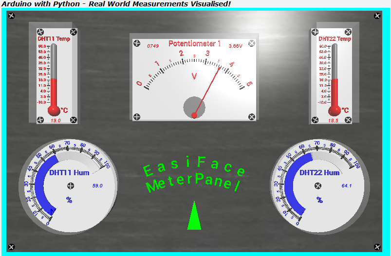
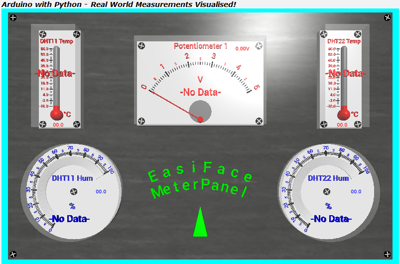
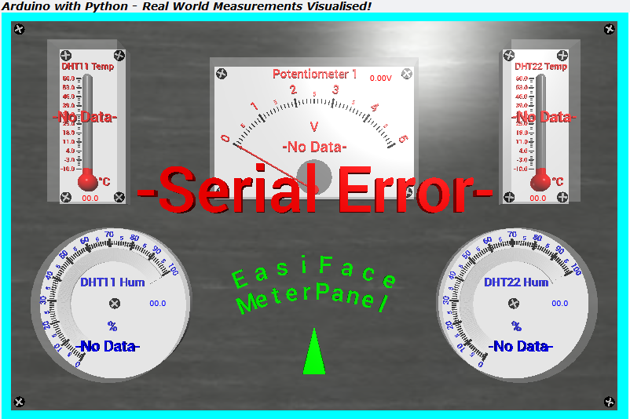

# TTB-AP-Lesson8
My Solution to Paul McWhorter's "Arduino with Python: LESSON 8" homework.

Visit Paul's video here:
 - https://youtu.be/watch?v=xgzbRYzQWPE

You can get Paul's code here:
 - https://toptechboy.com/using-an-arduino-with-python-lesson-8-live-thermometer-3d-visual-using-dht11/

You can see my solution demonstrated here:
 - https://youtu.be/BuIVGkOTPL4

My Arduino sketch uses some "poor man" multitasking with "millis()" and the Python code now has a round meter!

## My EasiFace Meter Panel - All OK:

## My EasiFace Meter Panel - No Data:

## My EasiFace Meter Panel - Serial Error:

